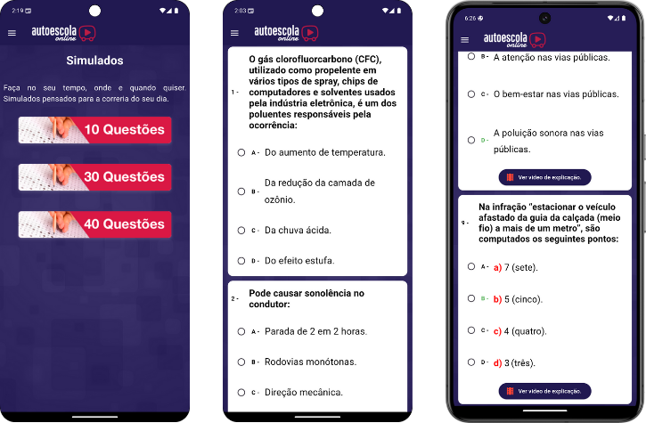

# .png) Atualização do App AutoescolaOnline

Um aplicativo que foi criado em 2020 e nao recebeu nenhuma atualizacao após isso pela empresa Legtransito LTDA. Refêrencia nacional com relação a Trânsito e ajudando uma imensa comunidade a conseguir se Aprovado na Prova Teórica do Detran.

O Aplicativo tem o objetivo de ajudar a comunidade a Decorar as placas de Trânsito e liberar alguns simulados para o cliente testar o seu conhecimento. Essa são as suas principais funcionalidades e sua finalidade, contando também com uma API que retornar os videos do Youtube no canal para o aplicativo sendo possivel assistir os mesmo no aplicativo, sem a necessidade de ir até o app do Youtube, e também tem o blog de notícias. 

 

## Atualizações que Foram Necessárias

Ao pegar o aplicativo com a liguagem Flutter que foi desenvolvida, foi necessário de 3 a 4 dias para a leitura completa da aplicação e entender como que funcionava a parte de dentro nos códigos. Após isso, fiz uma pesquisa para saber o que havia atualizado na linguagem Dart e Flutter para que pudesse estar primeiramente atualizado com a linguagem usada, e percebi que a principal era a mudança para o Null Safety do dart, que consiste que todas as variaveis e funcoes que retornem nulo seja declarada como Nula ou Não Nula. 

E então dentro aii de 2 dias, com os códigos atualizados ele já estava apto para rodar nas novas versoes do android.. Fazendo os primeiros testes, ja vi alguns erros que consistiam em não atualizar a lista de videos novos do Youtube, isso era devido a versao antiga do Dart, assim que atualizei, este problema ja foi resolvido. 

O segundo era que a parte do Blog de noticias, estava dando erro pois a requisição na API voltava sempre o 'author' como "Null", entao eu olhei no site e percebi que no cadastro, nunca usaram quem era o Autor, sempre deixando ele nulo( apesar que so tinha uma opção) logo eu simplesmente removi a variavel de author da requição e voltou a funcionar normalmente.

Esses era os principais erros que constavam no app para a funcionalidade nele. Após isso fizemos algumas modificações.. sendo elas 

##  Mudança no Visual

Começamos fazendo um pequeno protótipo do que seria feito nessa atualização visual. Com a ajuda de um designer fizemos esse protótipo:

#### Protótipo:

A mudança em como as questoes dos simulados apareciam para o usúario é a principal mudança, onde antigamente, as questões eram todas visualizadas de uma unica vez, sendo não tendo um total feedback se a questão foi ou não selecionada ( Por conta do Radio ). Mudei para colocar uma por vez, e o modo de seleção foi em todo o Container usando um GestureDetector para mudar de cor também quando clicado, selecionamos o amarelo, de acordo com o protótipo, e para questoes certas o verde, erradas o vermelho. As demais foram em como aparece quando o usúario não adiquiriu a versão Plus do app, e após ele adiquirir. 

#### Antes:

#### Depois:

## Ponto de Apredizagem

Nesta jornada de aprendizagem atualizando um aplicativo, eu pude entender como trabalhar em um projeto onde não é meu, a me encaixar um pouco na lógica de outro programador, tendo em vista também a complexidade de uma linguagem e a construção para os dispositivos mobile. Aprendi as configurações do Gradlew, as dependências e atualizações de versão para a possibilidade de atualização e aceitação de acordo com as Políticas da Google Play. Construção de Widgets na linguagem Flutter responsivo, e o melhor de tudo que não posso esquecer. 

O entusiasmo ao projeto estava tão grande, que dentre as conversas para a finalidade do aplicativo estar de agrado ao cliente, não foram deixadas claras em como seria realmente após ele estar atualizado, e então em uma conversa para terminar, faltando apenas implementar uma nova forma de cobrança(antes era de um produto CONSUMIVEL, e depois iria passar para um NÃO CONSUMIVEL ) foi informado que não usaria mais a versão do aplicativo da forma Plus, e que não queria que mudasse no visual, poderia deixar da forma antiga. A primeiro momento eu fiquei um pouco decepcionado, pois ja poderia entregar o aplicativo a 2 semanas atras se ja tivesse me falado nas primeiras reuniões. E Então, venho falar de mais uma habilidade que eu aprendi durante o aplicativo. 

A comunicação entre do programador e o cliente precisa ser mais clara possivel, tendo sempre que dar o feedback do que está fazendo e de como ele quer continuar, evitando a perda de tempo construindo algo que não tem necessidade ou que não estará de acordo com o cliente. Mas venho expor também a facilidade de conseguir após o cliente me falar algo que de fato era mais fácil e rápido de fazer, graças ao aprendizado do uso do GitHub, e ter todas as versões atualizadas que estavam funcionando, com todos os códigos já prontos para simplesmente aplicar do jeito que o cliente desejava, foi BASTANTE eficaz para ao chegar em casa, finalizar a aplicação no mesmo dia, e assim, enviar a versão atualizada para o Google Play. 

# Conclusão

Foi bastante emocionante e de grande aprendizagem a trajetória trabalhando neste aplicativo, sendo meu primeiro aplicativo postado na Play Store, entendendo das Políticas do mesmo. Sendo uma oportunidade imensa de conseguir finalizar o projeto em uma linguagem um pouco desconhecida da minha parte, consegui aprimorar minhas habilidades na linguagem Dart e na construção em Flutter. Apesar de imensas dificuldades desde instalar o pacote Flutter na minha máquina, até aprender com todas as rejeições da Google Play, eu consegui finalizar e já está em funcionamento na Play Store. Vou deixar o link abaixo caso queira baixar, e vou deixar um video do aplicativo que não foi usado (devida a falta de conversas) para a avaliação também ( eu particulamente gostei mais da 'Nova versão'). Obrigado pela leitura e seguimos aprendendo.. 

## Link para Baixar

Se você deseja testar o aplicativo na Play Store, clique no botão abaixo ⬇️

#### Vídeo do Aplicativo Fucionando 

Vou deixar o video do Aplicativo funcionando antes de ter a conversa que não queria mais o App com a versão Plus.

[Assista ao Vídeo do aplicativo com a Atualização do Design](https://drive.google.com/drive/folders/1WTDz-GzLaU5fsoWreWAGu4oh8ZCofXl9?usp=sharing)

